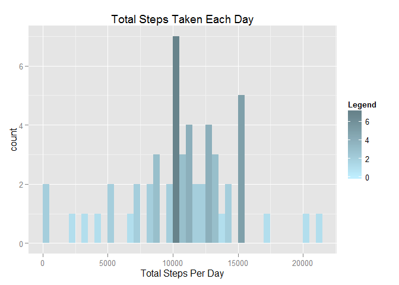
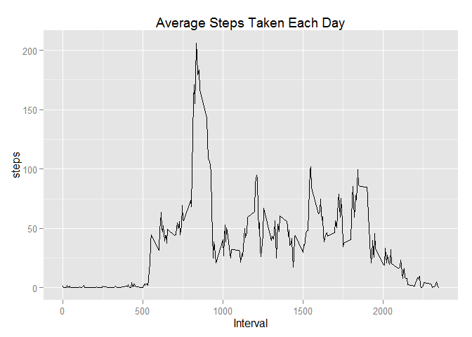
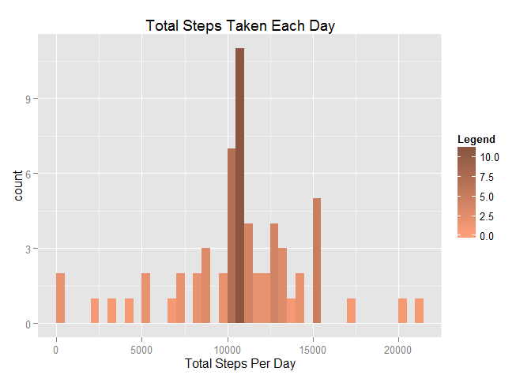
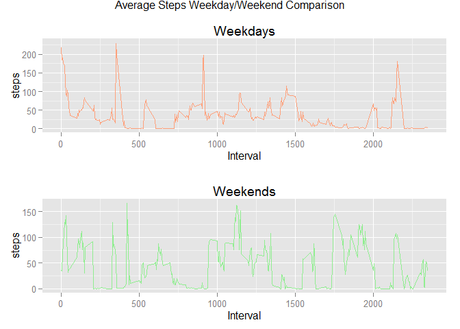

# Reproducible Research Peer Assessment 1

It is now possible to collect a large amount of data about personal movement using activity monitoring devices such as a Fitbit, Nike Fuelband, or Jawbone Up. These type of devices are part of the “quantified self” movement – a group of enthusiasts who take measurements about themselves regularly to improve their health, to find patterns in their behavior, or because they are tech geeks. But these data remain under-utilized both because the raw data are hard to obtain and there is a lack of statistical methods and software for processing and interpreting the data.  
  
This assignment makes use of data from a personal activity monitoring device. This device collects data at 5 minute intervals through out the day. The data consists of two months of data from an anonymous individual collected during the months of October and November, 2012 and include the number of steps taken in 5 minute intervals each day.  
  
1. Loading and preprocessing the data


```r
#load required packages
library(ggplot2)
library(grid)
library(gridExtra)

#initialisation code
fname = "activity.csv"
zipURL = "https://d396qusza40orc.cloudfront.net/repdata%2Fdata%2Factivity.zip"

# If the raw data has not been saved, download, unzip, and load it.
# Save it to an .rds file for easy access later.
if (!file.exists(fname)) {
  download.file(zipURL,
                destfile='raw-data.zip')
  unzip('raw-data.zip')
  
  # Read data into a table with appropriate classes
  activity.df <- read.table(fname, header=TRUE,
                         sep = ',', na.strings = 'NA',
                         colClasses = c('numeric', 'character', 'numeric'))
  
  #save dataset
  saveRDS(activity.df, file='activity-data.rds')
  
} else {
  #load previously loaded file
  activity.df <- readRDS('activity-data.rds')
  
}

#convert date field from imported character format
activity.df$date <- as.Date(activity.df$date, format="%Y-%m-%d")
#filter NAs
act_filtered.df <- activity.df[which(!is.na(activity.df$steps)),]
```
  
2. What is mean total number of steps taken per day?
  Make a histogram of the total number of steps taken each day  

```r
#aggregate dataset to show steps per day
steps_per_day.df <- aggregate(steps ~ date, data=act_filtered.df, FUN=sum)

#using ggplot package
plot1 <- ggplot(steps_per_day.df, aes(x=steps, fill=..count..)) +
  geom_histogram(origin = 0, binwidth = 500) + 
  scale_fill_gradient("Legend", low="lightblue1", high="lightblue4") +
  xlab("Total Steps Per Day") +
  ggtitle("Total Steps Taken Each Day")
```

  Which produces the following chart:  

```r
 print(plot1)
```

 

The calculated mean value is:

```r
mean(steps_per_day.df$steps)
```

```
## [1] 10766.19
```
  
The calculated median value is:  


```r
median(steps_per_day.df$steps)
```

```
## [1] 10765
```
3. What is the average daily activity pattern?  
  

```r
avg_steps_per_interval.df <- cbind(unique(act_filtered.df$interval), 
                                   tapply(act_filtered.df$steps, act_filtered.df$interval, mean))
avg_steps_per_interval.df <- as.data.frame(avg_steps_per_interval.df)
colnames(avg_steps_per_interval.df) <- c("interval", "steps")

plot2 <- ggplot(avg_steps_per_interval.df, aes(x=interval, y=steps), type = "l") +
                geom_line() + 
                xlab("Interval") + 
                ggtitle("Average Steps Taken Each Day")
print(plot2)
```

 

Which 5-minute interval, on average across all the days in the dataset, contains the maximum number of steps?


```r
avg_steps_per_interval.df[which.max(avg_steps_per_interval.df[,"steps"]),]
```

```
##     interval    steps
## 835      835 206.1698
```
  
4. Imputing missing values  

Calculate and report the total number of missing values in the dataset (i.e. the total number of rows with NAs)  
  

```r
sum(is.na(activity.df$steps))
```

```
## [1] 2304
```

Create a new dataset that is equal to the original dataset but with the missing data filled in.


```r
activity_imputed.df <- activity.df
activity_imputed.df$steps[(is.na(activity_imputed.df$steps)) & (avg_steps_per_interval.df$interval %in% activity_imputed.df$interval)] <- avg_steps_per_interval.df$steps
```
  
Make a histogram of the total number of steps taken each day and Calculate and report the mean and median total number of steps taken per day. Do these values differ from the estimates from the first part of the assignment? What is the impact of imputing missing data on the estimates of the total daily number of steps?  


```r
#get total steps per day for new data
steps_per_day_imp.df <- aggregate(steps ~ date, data=activity_imputed.df, FUN=sum)

#create histogram
plot3 <- ggplot(steps_per_day_imp.df, aes(x=steps, fill=..count..)) +
  geom_histogram(origin = 0, binwidth = 500) + 
  scale_fill_gradient("Legend", low="lightsalmon1", high="lightsalmon4") +
  xlab("Total Steps Per Day") +
  ggtitle("Total Steps Taken Each Day")

print(plot3)
```

 
  
Calculate and report the mean and median total number of steps taken per day  


```r
mean(steps_per_day_imp.df$steps)
```

```
## [1] 10766.19
```

```r
median(steps_per_day_imp.df$steps)
```

```
## [1] 10766.19
```
5. Are there differences in activity patterns between weekdays and weekends?

  Make a time series plot (i.e. type = "l") of the 5-minute interval (x-axis) and the average number of steps taken, averaged across all days (y-axis)  
  

```r
#Create a new factor variable in the dataset with two levels – “weekday” and “weekend” indicating whether a given date is a weekday or weekend day.
weekdays <- as.factor(weekdays(activity_imputed.df$date))
activity_imputed.df$WeekDay <- weekdays

#create reference table to identify weekdays/weekends
WeekDay <- c("Monday","Tuesday","Wednesday","Thursday","Friday", "Saturday", "Sunday")
DayClass <- c(rep("WeekDay",5), rep("WeekEnd",2))
WeekdayClass <- cbind(WeekDay,DayClass)

activity_imputed_inc_wkday.df <- merge(activity_imputed.df, WeekdayClass, by="WeekDay", all.x=TRUE)

#create new dataset of mean steps per date (weekdays)
activity_imputed_wkday.df <- activity_imputed_inc_wkday.df[which(activity_imputed_inc_wkday.df$DayClass == "WeekDay"),]
avg_steps_per_int_imp_wkday.df <- cbind(unique(activity_imputed_wkday.df$interval),
                                   tapply(activity_imputed_wkday.df$steps, activity_imputed_wkday.df$interval, mean))
avg_steps_per_int_imp_wkday.df <- as.data.frame(avg_steps_per_int_imp_wkday.df)
colnames(avg_steps_per_int_imp_wkday.df) <- c("interval", "steps")

#create new dataset of mean steps per date (weekend)
activity_imputed_wkend.df <- activity_imputed_inc_wkday.df[which(activity_imputed_inc_wkday.df$DayClass == "WeekEnd"),]
avg_steps_per_int_imp_wkend.df <- cbind(unique(activity_imputed_wkend.df$interval),
                                        tapply(activity_imputed_wkend.df$steps, activity_imputed_wkend.df$interval, mean))
avg_steps_per_int_imp_wkend.df <- as.data.frame(avg_steps_per_int_imp_wkend.df)
colnames(avg_steps_per_int_imp_wkend.df) <- c("interval", "steps")


plot4_1 <- ggplot(avg_steps_per_int_imp_wkday.df, aes(x=interval, y=steps), type = "l") +
  geom_line(colour = "lightsalmon") +
  xlab("Interval") + 
  ggtitle("Weekdays")

plot4_2 <- ggplot(avg_steps_per_int_imp_wkend.df, aes(x=interval, y=steps), type = "l") +
  geom_line(colour = "lightgreen") +
  xlab("Interval") + 
  ggtitle("Weekends")


grid.arrange(plot4_1, plot4_2, nrow = 2, main = "Average Steps Weekday/Weekend Comparison")
```

 

  
